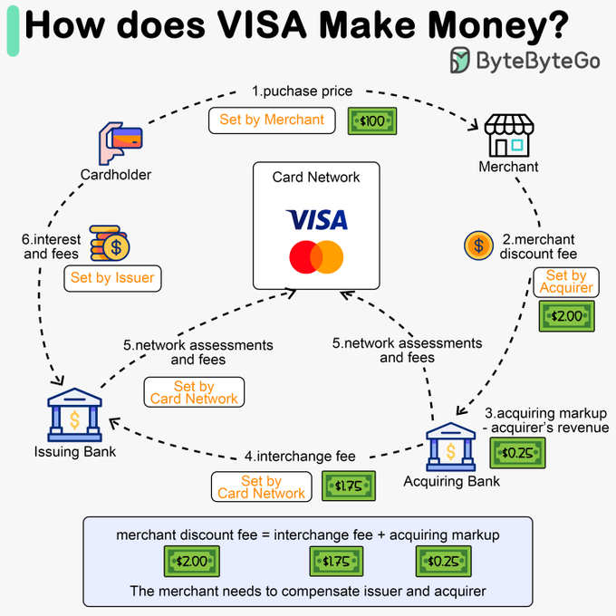

# Aula I
We see three critical differences between programming and software engineering: time, scale, and the trade-offs at play. On a software engineering project, engineers need to be more concerned with the passage of time and the eventual need for change. 
In a software engineering organization, we need to be more concerned about scale and efficiency, both for the software we produce as well as for the organization that is producing it. 
Finally, as software engineers, we are asked to make more complex decisions with higher-stakes outcomes, often based on imprecise estimates of time and growth.

## Comentário:
Baseado no trecho, é possível notar que a engenharia de software, embora semelhante á área da programação possui características distintas, pois é mais relacionada ao tempo, escala e trade-offs, além da tomada de decisões mais complexas baseadas em estimativas imprecisas.
Um engenheiro de software, tem que pensar em quais linguagens vão atender melhor a demanda e também suportar as melhorias que virão com o tempo sendo elas complexas ou não, onde essa tecnologia consiga ter um desempenho bom e capacidade de escalabilidade, sendo uma decisão extremamente difícil e complexa, as vezes demandando investimentos mais altos, mas que se pagam em pouco tempo devido a capacidade da tecnologia de lidar com a problemática proposta.

# Aula II (continuação)
Within Google, we sometimes say, “Software engineering is programming integrated over time.” Programming is certainly a significant part of software engineering: after all, programming is how you generate new software in the first place. If you accept this distinction, it also becomes clear that we might need to delineate between programming tasks (development) and software engineering tasks (development, modification, maintenance). 
The addition of time adds an important new dimension to programming. Cubes aren’t squares, distance isn’t velocity. Software engineering isn’t programming.

## Comentário 
Sabe-se que a programação está diretamente relacionada á engenharia de software, e de fato, a programação é extremamente importante para um engenheiro de software. 
Entretanto, não pode-se resumir á isso, pois a engenharia de software não é programação, assim como cubos não são quadrados. 
A engenharia de software não está apenas relacionada á criar um novo software, mas também, ao desenvolvimento, modificação e manutenção do mesmo. 
É de extrema importância compreender que certas funcionalidades da sua aplicação funcionam melhor em certas linguagem, e  é preciso desenvolver elas de forma que elas consiga comunicar entre si
A engenharia de software abrange muito mais que a programação, é muito mais que somente solucionar algum problema atráves de um código, é pensar quais melhores tecnologias para ter essa resolução, se essa tecnologia consegue se adaptar as possíveis demandas e mudanças do futuro e pensar além da solução mais fácil ou mais barata, é documentar o que o sistema precisa fazer e como ele vai fazer, é ter uma metologia de descrever requisitos, regras de negocio para se ter um desenvolvimento de um software de qualidade e que todos os programadores consigam trabalhar de maneiram mais coesa e eficiente.

# Aula III
## Exemplos de trade-offs com requisitos não funcionais
### 1. Desempenho vs. Segurança
Trade-off: Para melhorar o desempenho, o desenvolvedor opta por minimizar a complexidade dos processos de criptografia ou reduzir o número de verificações de segurança.
Entretanto, isso pode diminuir a segurança do sistema, tornando-o mais vulnerável a ataques.

### 2. Usabilidade vs. Segurança
Trade-off: Tornar o sistema extremamente seguro, com a implementação de múltiplas camadas de segurança (como autenticação biométrica, códigos de verificação etc.) pode tornar a experiência do usuário mais complexa e frustrante, prejudicando a usabilidade e tornando o sistema mais difícil de ser acessado, levando os usuários a evitarem o uso adequado da ferramenta e uma possível perda de clientes. 

### 3. Disponibilidade vs. Manutenibilidade
Trade-off: Para garantir alta disponibilidade do sistema, é possível reduzir a frequência de manutenções e atualizações, o que, por sua vez, pode tornar o sistema mais difícil de manter e atualizar no longo prazo, além de acumular dívidas técnicas.

###  4. Custo vs. Desempenho
Trade-off: Com um orçamento limitado reduzir custos pode significar optar por infraestrutura de menor desempenho, como servidores mais baratos ou menos redundância, o que pode impactar o tempo de resposta do sistema e seu desempenho.

###  5. Desempenho vs. Facilidade de Desenvolvimento (C++ vs. Python)
C++ é uma linguagem de baixo nível que permite um controle fino sobre recursos e memória, o que pode resultar em um desempenho extremamente alto. 

No entanto, isso também torna o desenvolvimento mais complexo e propenso a erros, como vazamentos de memória.
Python, por outro lado, é uma linguagem de alto nível, fácil de aprender e usar, e permite um desenvolvimento mais rápido e com menos código. 

Trade-off: 
- **Escolhendo C++:** Você ganha em desempenho e controle sobre o hardware, o que é crucial para aplicações que exigem alta eficiência e precisam lidar com recursos limitados, como jogos, sistemas embarcados, e software de tempo real. Porém, o desenvolvimento se torna mais complexo, exigindo mais esforço para gerenciar a memória manualmente, depurar problemas de alocação e lidar com detalhes de baixo nível. Isso aumenta a chance de erros como vazamentos de memória e torna o código mais difícil de manter.

- **Escolhendo Python:** Você sacrifica o desempenho e o controle fino dos recursos, mas ganha em facilidade e velocidade de desenvolvimento. Python é mais simples, com uma sintaxe mais limpa e uma grande quantidade de bibliotecas prontas para uso, o que acelera o processo de criação de protótipos e desenvolvimento de aplicações. No entanto, para aplicações que exigem desempenho máximo, Python pode não ser a melhor escolha, pois sua execução é mais lenta em comparação a C++.

------------------------------------------------------------------------------------------------------------------------
> :memo: **Atividade:** Analisar os trade-offs de requisitos não-funcionais utilizados por uma arquitetura de empresa que utiliza tecnologia. 

Para analisar os trade-offs de requisitos não-funcionais utilizados por uma arquitetura da Visa no contexto de engenharia de software, podemos considerar os seguintes aspectos, observando como a Visa precisa equilibrar diferentes prioridades ao projetar sua arquitetura de sistema.

### 1. **Escalabilidade e Complexidade**
   **Descrição**: A Visa precisa processar **milhões de transações por segundo globalmente.**
    
   **Trade-offs**:
       
     - A escalabilidade é essencial para garantir que a rede da Visa possa lidar com o aumento do volume de transações, especialmente em períodos de pico como Black Friday ou Cyber Monday. Arquiteturas distribuídas e a utilização de data centers globais permitem escalar horizontalmente, adicionando mais recursos conforme necessário.
      
     - Porém, sistemas altamente escaláveis podem ser **mais complexos de manter e otimizar.** A replicação de dados para suportar a escalabilidade pode introduzir **desafios de consistência**, especialmente em sistemas distribuídos globalmente.

### 2. **Disponibilidade e Custo**
   **Descrição**: A rede de pagamento da Visa deve estar disponível 24/7 para garantir que as transações sejam processadas a qualquer momento.
       
   **Trade-offs**:
       
     - A **alta disponibilidade é crítica** para a confiança dos usuários e para o funcionamento das economias globais, evitando qualquer tempo de inatividade que possa prejudicar os negócios e os consumidores. Com isso, a Visa implementa o failover(tolerância a falhas) automático e redundância em sua infraestrutura para manter a disponibilidade contínua.
        
     - Entretanto, manter uma alta disponibilidade pode ser caro, **exigindo investimentos significativos em infraestrutura e gerenciamento.** Há uma necessidade de **equilibrar entre disponibilidade e manutenção,** onde atualizações contínuas e correções de bugs precisam ser implementadas **sem interromper os serviços.**     

### 3. **Desempenho e Concessões**
   **Descrição**: A Visa deve garantir que as transações sejam processadas em milissegundos.
       
   **Trade-offs**:
       
     - O desempenho rápido é fundamental para uma boa experiência do usuário e para permitir o processamento de grandes volumes de transações sem atrasos. Realizar otimizações de desempenho garantem que o sistema possa processar cada transação em tempo real.
        
     - Mas, melhorar o desempenho pode exigir concessões em termos de flexibilidade e capacidade de personalização do sistema. Há também o **risco de que otimizações específicas prejudiquem outros aspectos do sistema,** como a manutenibilidade ou escalabilidade.

### 4. **Segurança e Experiência do Usuário (Complexidade)**
   **Descrição**: A Visa deve proteger as informações financeiras dos usuários e garantir que as transações sejam seguras.
       
   **Trade-offs**:
       
     - A **segurança é um dos requisitos mais críticos**, dado que a Visa lida com informações financeiras sensíveis e grandes volumes de transações diárias. **Implementar criptografia robusta**, autenticação multifator e sistemas de detecção de fraude são essenciais para proteger os dados e a integridade das transações.
 
     - Entretanto, implementar e manter altos padrões de segurança **pode impactar negativamente o desempenho e a experiência do usuário.** A segurança também pode aumentar a complexidade do sistema, tornando mais difícil a implementação de novas funcionalidades ou a adaptação a novas tecnologias.

### 5. **Consistência e Latência**
   **Descrição**: A Visa precisa garantir que todas as transações sejam processadas corretamente e que os saldos sejam atualizados em tempo real.
       
   **Trade-offs**:
       
     - **Consistência forte** garante que todas as partes envolvidas em uma transação tenham uma visão precisa e atualizada dos dados financeiros. É crucial para evitar erros financeiros que poderiam resultar em disputas ou perda de confiança na rede Visa.
 
     - Por outro lado, garantir consistência forte, especialmente em um sistema distribuído, pode **aumentar a latência e reduzir a disponibilidade.**. Em algumas situações, a Visa pode optar por consistência eventual para melhorar o desempenho, com a condição de que os sistemas sejam projetados para resolver quaisquer inconsistências rapidamente.

### 6. **Resiliência e Complexidade/Custo**
   **Descrição**: O sistema da Visa deve ser resiliente a falhas e capaz de se recuperar rapidamente em caso de problemas.
       
   **Trade-offs**:
       
     - A resiliência é essencial para **garantir que as operações da Visa continuem, mesmo diante de falhas em componentes individuais ou ataques cibernéticos.** Mecanismos de fallback(contingência) e recuperação automática garantem que as transações possam ser completadas mesmo em situações adversas.
   
     - Porém, **aumentar a resiliência pode aumentar a complexidade da arquitetura**, bem como o custo de manutenção e operação. Testar e garantir a resiliência requer esforços contínuos, incluindo a implementação de ambientes redundantes e práticas de simulação de falhas.

### 7. **Manutenibilidade e Eficiência**
   **Descrição**: A Visa precisa manter e atualizar continuamente sua plataforma sem causar interrupções nos serviços.
       
   **Trade-offs**:
       
     - Manutenibilidade é **crucial para permitir atualizações frequentes e para a correção de bugs, garantindo que o sistema permaneça seguro e eficiente.** Uma arquitetura modular e bem documentada facilita as tarefas de manutenção e a introdução de novas funcionalidades.
   
     - Mas, a alta manutenibilidade pode entrar em **conflito com outras prioridades**, como desempenho e segurança, especialmente se envolver reestruturações frequentes. **Sistemas altamente manuteníveis podem ser menos eficientes** em termos de desempenho e custo, devido à necessidade de suportar flexibilidade e extensibilidade.

### Conclusão:
A arquitetura da Visa deve equilibrar cuidadosamente esses requisitos não-funcionais para **oferecer um sistema seguro, eficiente e confiável.** Cada decisão de design envolve trade-offs que impactam a funcionalidade geral e a capacidade da Visa de atender às necessidades dos seus clientes, incluindo emissores, adquirentes, comerciantes e portadores de cartão.
A Visa, como líder em pagamentos, precisa priorizar continuamente esses requisitos para manter sua posição no mercado e garantir uma experiência segura e eficiente para todos os usuários.

-----------------------------------------------------------------------------------------------------------------------------
# Aula IV
https://huggingface.co/blog/vlms

VLM (VIsual Language Model): Arquitetura Multimodal 

-----------------------------------------------------------------------------------------------------------------------------
##
# Anotações:
Trade-off são as escolhas e as renúncias que vem com elas, que todo engenheiro de software precisa fazer durante o planejamento, desenvolvimento e manutenção de um software. Um exemplo clássico de trade-off é a escolha da linguagem de programação a ser utilizada durante o desenvolvimento, cada linguagem possui suas vantagens e desvantagens, e é necessário analizar as necessidades do cliente e fazer a escolha que melhor as atenda, para que o software consiga realizar o seu propósito.

### Processo de trade-off de arquitetura de software:
1. Identificação de Requisitos e Restrições:
- Identificação de requisitos funcionais e não funcionais do sistema.
- Considere as restrições de recursos, como orçamento, tempo, tecnologias disponíveis e conhecimento da equipe.

2. Análise de Requisitos Conflitantes:
- Identificação dos requisitos que podem entrar em conflito ou competir entre si.
- Por exemplo, pode haver um trade-off entre desempenho e consumo de recursos, ou entre flexibilidade e simplicidade.

3. Priorização de Requisitos:
- Classificação dos requisitos de acordo com sua importância e impacto no sistema.
- Determine quais requisitos são críticos e quais podem ser negociados ou ajustados.

4. Avaliação de Alternativas:
- Explorar diferentes abordagens para atender aos requisitos.
- Considere alternativas de design que abordem os trade-offs identificados.

5. Análise de Impacto:
- Avaliar o impacto de cada alternativa nos requisitos e nas restrições.
- Considere como as escolhas afetarão o desempenho, a segurança, a manutenibilidade, entre outros atributos.

6. Modelagem e Simulação:
- Utilizar técnicas de modelagem e simulação para prever o comportamento do sistema sob diferentes condições.
- Isso pode incluir modelagem de desempenho, análise de riscos, entre outras abordagens.

7. Tomada de Decisão:
- Com base na análise, tomar decisões informadas sobre a arquitetura do sistema.
- Se necessário, envolva partes interessadas para validar as escolhas e obter feedback.

8. Documentação e Comunicação:
- Registro das decisões de arquitetura, destacando os trade-offs feitos.

9. Avaliação Contínua:
- Reavaliar periodicamente as decisões de arquitetura à medida que o projeto progride e novas informações se tornam disponíveis.
- é de extrema imprtância estar sempre preparado para ajustar a arquitetura conforme necessário.

### O processo de trade-off de arquitetura de software é uma parte essencial do desenvolvimento de sistemas complexos e ajuda a garantir que as decisões tomadas estejam alinhadas com os objetivos do projeto e as restrições existentes.
fonte: https://pt.linkedin.com/pulse/trade-off-cada-escolha-%C3%A9-uma-ren%C3%BAncia-cleber-da-silveira-wfupf

### Requisitos (necessidades do cliente):
- Funcionais: tarefas e ações do sistema, geralmente exemplificadas por verbos (exemplo: realizar cadastro)
- Não funcionais: qualidades do sistema (exemplo: portabilidade)

### Multimodal:
Modelos multimodais são sistemas de IA projetados para processar e interpretar múltiplas formas de dados simultaneamente. 
Incluindo textos, imagens, áudios e até dados sensoriais, permitindo uma análise mais holística(inteira) e uma geração de conteúdo mais integrada. 
- Um exemplo clássico é um sistema que pode analisar uma imagem e gerar uma descrição textual detalhada, ou vice-versa, compreender um texto e gerar uma imagem correspondente.

Esses modelos são amplamente utilizados em diversas aplicações práticas. 
- No reconhecimento de imagem e texto, por exemplo, eles podem identificar objetos em uma foto e descrevê-los em palavras.
- Na tradução automática, os modelos multimodais podem usar imagens para contextualizar melhor as traduções, resultando em uma maior precisão.
- Na geração de conteúdo, eles podem criar descrições detalhadas para vídeos ou gerar novas imagens a partir de descrições textuais, ampliando as possibilidades criativas.
